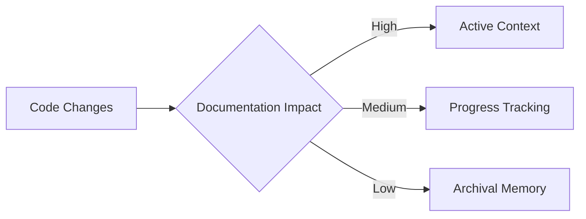

# Mementor Product Brief

## Version History
| Version | Date       | Author          | Changes                 |
|---------|------------|-----------------|-------------------------|
| 0.1.0   | 2025-02-07 | AI Assistant    | Initial version         |

## Overview
Mementor is a Python-based CLI tool designed to implement and maintain a three-tier documentation memory system for software projects. It enables living documentation that evolves with code through automated management patterns.

## Key Features
1. **Tiered Documentation System**
   - Active Context: Short-term decisions (`activeContext.md`)
   - Progress Tracking: Mid-term milestones (`progress.md`)
   - Archival Memory: Versioned snapshots (`archives/YYYY/`)

2. **Core Capabilities**
   - `memory-system init`: Scaffolds documentation structure
   - `memory-system snapshot`: Creates timestamped archives
   - Template-driven documentation generation
   - Configuration management via `pyproject.toml`

3. **Technical Foundation**
   - CLI-first design with Git-like commands
   - Markdown-based documentation ecosystem
   - Automated dependency tracking between technical decisions and implementation

## Design Philosophy

## Implementation Status
- **Current Version**: 0.1.0 (Pre-alpha)
- **Test Coverage**: 0% (Critical TODO)
- **Dependencies**: Python 3.10+

## Living Document Notice
This brief should be updated with:
- Major feature additions
- Architectural changes
- Version milestone achievements
- Community adoption patterns

© 2025 Mementor Project. Document version: 0.1.0
